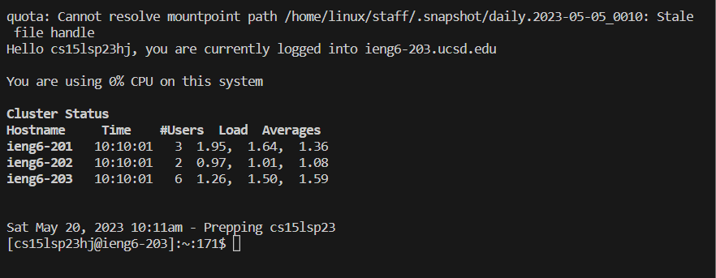
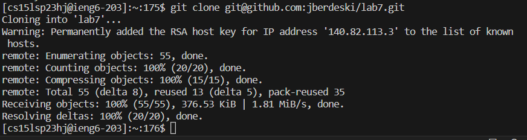
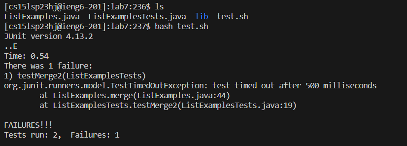
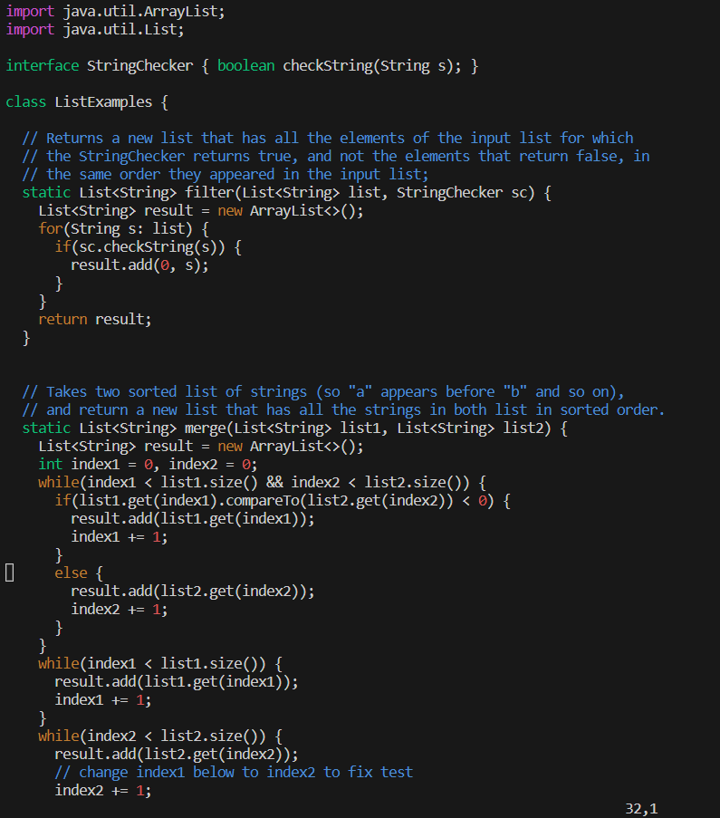
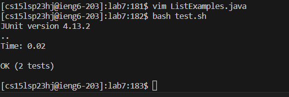
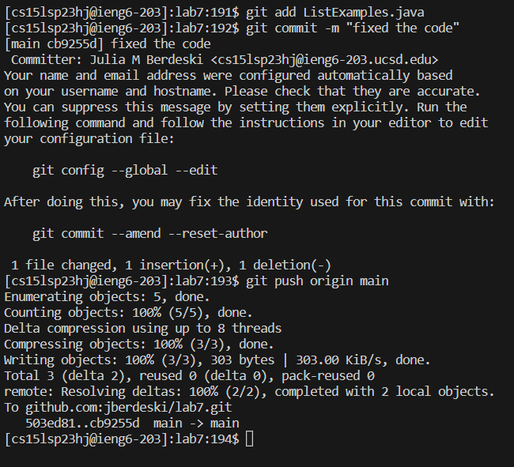

# Using Vim to Edit Code

`vim` is a a free and open-source, screen-based text editor program.
> definition from wikipedia.com

# Demo Use of Vim

**_What is our task?_**

Our task is to download and clone code that has an error in it and use vim to fix that error.

## Step 1
**Logging in to ieng6:**

If you have seen my other pages you will find a tutorial on [how to log in to a remote account](https://jberdeski.github.io/cse15l-lab-report1/report-steps.html).
However this case is slightly different as I have set it up to no longer require a password to log in,
so all I have to do is use:

`ssh cs15lsp23__@ieng6.ucsd.edu`

> __ is to be filled in with the leters specific to your account

## Step 2
**Clone your Fork of the Repository from your Github Account:**

In order to do this we will use the command:
`git clone ___________`
> ________  is to be filled in with a link to the forked repository
> depending on if you have it set up or not; you can use the HTTPS link or the SSH link

## Step 3
**Running the Tests (they should fail right now):**

First I wanted to make sure I was in the right directory so I did:
`cd lab7/`
Then I checked what files were in the directory by using:
`ls`
To run the tests I used:
`bash test.sh` 
since it was in the directory when I used `ls`.

## Step 4
**Fixing the Error Through `vim`:**

The first thing I did was run:
`vim LabExamples.java`
This allowed me to look into the file that had the error.
> In this example I know what and where the error is and how to fix it so these steps will be very specific to this example

*The Steps:*

1) *`/index1 <enter>`*
  
  > This searches up the term after the / 
  
2) *`n n n n n n n n n n`*
  
  > I moved to the **n**ext term that matches the search till I reached the last one
  
3) *`<right><right><right><right><right>`*
  
  > moved over to the error in the line (where it said index1 instead of 2)
  > my cursor was directly over the 1
  > *note that right can be executed by pressing the right arrow key or l*
 
  
4) ` *x* `
  
  > deletes what is directly below my cursor (in other words, what the cursor is on)
  
5) *`i`*
  
  >puts me into insert mode
  
6) *`2`*
  
  > inserts 2 
  
7) *`<esc>`*
  
  >takes me out of insert mode and back to normal mode
  
8) *`:wq`*
  
  > saves and quits `vim`
  
  
  
## Step 5
**Testing the Fixed Code**
  
Following the same steps as before to test the code:
`bash test.sh`
We can see that the tests now pass.
  

  
## Step 6 
** The Final Step: Commiting and Psuhing Changes**
  
There are 3 commands to this step:
`git add LabExamples.java`
  > tells git which file you are going to be pushing to the main account
  
`git commit -m "_____"`
  >fill ____ with a comment about what this commit was
  >saves what was changed
  
`git push origin main`
  >pushes the file specified above to the main account

